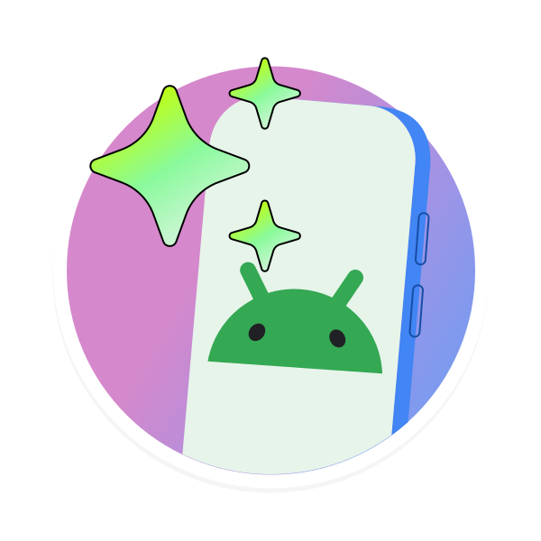
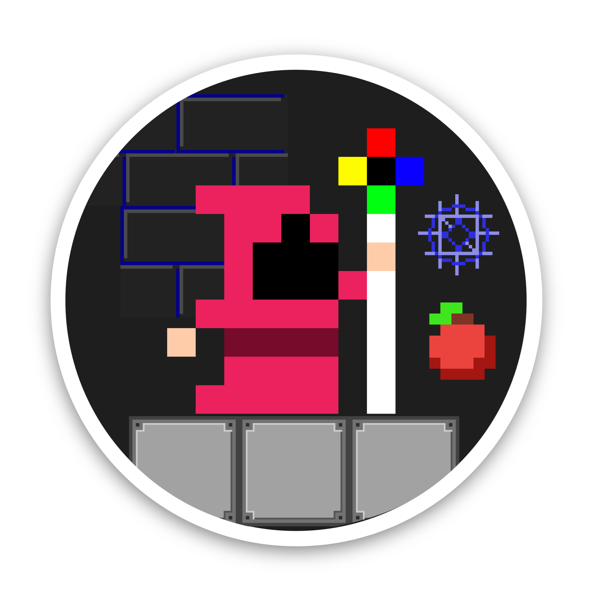
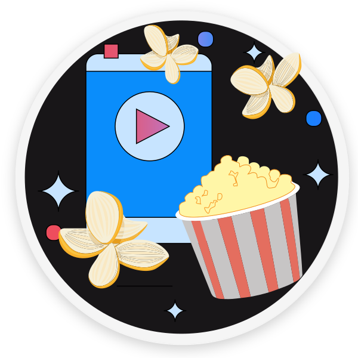
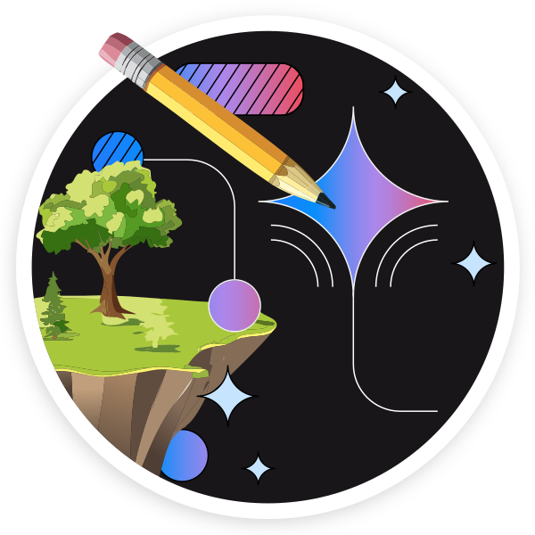
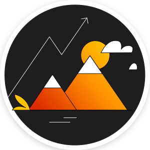
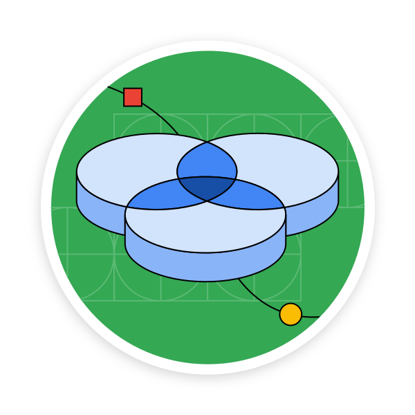
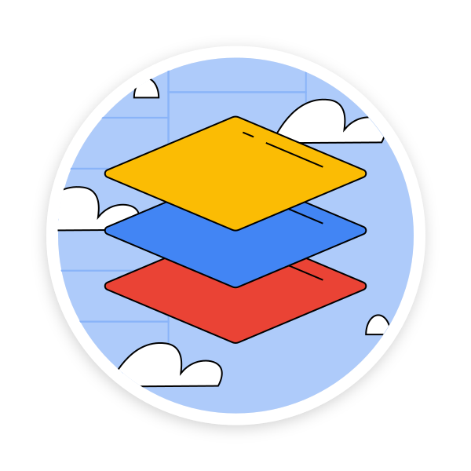
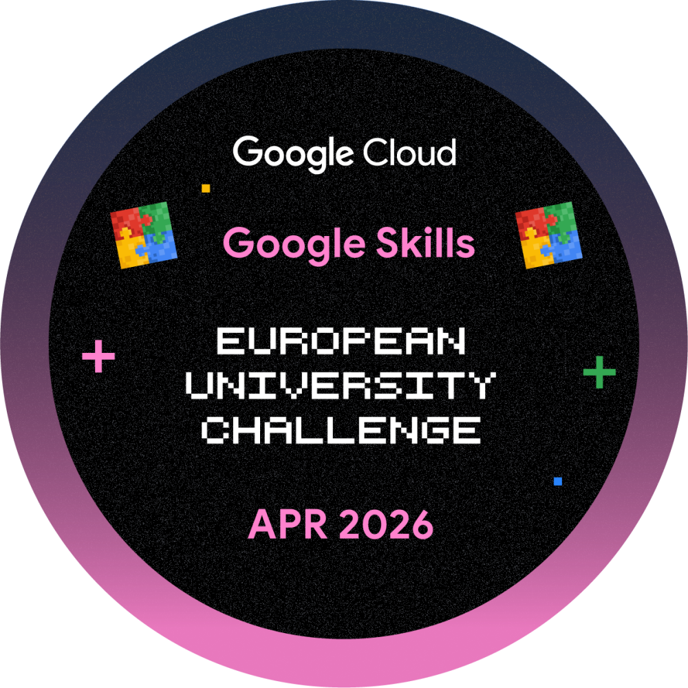

  
  

# 🏛️ The Polymath Archives

<table width="100%">
  <thead>
    <tr>
      <th>Category</th>
      <th>Discipline</th>
      <th>Area</th>
      <th>Experience</th>
      <th>Milestone</th>
    </tr>
  </thead>
  <tbody>
    <tr>
      <td rowspan="4" align="center"><b>STEM</b></td>
      <td>🧪 Mathematics</td>
      <td>Academic Researcher & Olympiad</td>
      <td>2+ years</td>
      <td><b>Regional Finalist</b></td>
    </tr>
    <tr>
      <td>💻 Computing</td>
      <td>Full Stack Web Development</td>
      <td>3+ years</td>
      <td><i>Coming soon...</i></td>
    </tr>
    <tr>
      <td>⚗️ Chemistry</td>
      <td>Olympiad</td>
      <td>1 year</td>
      <td><b>Regional Finalist</b></td>
    </tr>
    <tr>
      <td>⚛️ Physics</td>
      <td>Olympiad</td>
      <td>1 year</td>
      <td><b>Regional Finalist</b></td>
    </tr>
    <tr>
      <td rowspan="3" align="center"><b>Humanities & Arts</b></td>
      <td>📚 Literature</td>
      <td>Writer & Competitions</td>
      <td>5+ years</td>
      <td><b>Double International Top 1</b></td>
    </tr>
    <tr>
      <td>🗣️ Linguistics</td>
      <td>Olympiad</td>
      <td>1 year</td>
      <td><b>NOL Top 4</b></td>
    </tr>
    <tr>
      <td>🎨 Arts</td>
      <td>Competition</td>
      <td>1 month</td>
      <td>Top 1 Regionally (Ongoing)</td>
    </tr>
    <tr>
      <td align="center"><b>Physical</b></td>
      <td>🤺 Fencing</td>
      <td>Competitive</td>
      <td>3 years</td>
      <td><b>Top 8 & 5 International</b></td>
    </tr>
  </tbody>
</table>

---

# 🙌 Achievements

<i> European University Challenge April 2026 </i> 
  <i>> 3/1071 with World Record</i> 
<i> Google Dev Program</i> 
  <i>> 45 Badges earned</i>

### 🏆 Certification Gallery

  
  
  
  
  
  
  
  
  
  

---

# 🛰️ System Architecture (Tech Stack)

  
  
  
  
   
  
  
  
  

---

# 📊 Languages used

  
  

# 📈 Activity

  

---

# 📡 CONNECT

  

  

